# 🧩 LocalSafeAI API シーケンス図（ポートレス構成・完全版）

---

## 🔐 login()

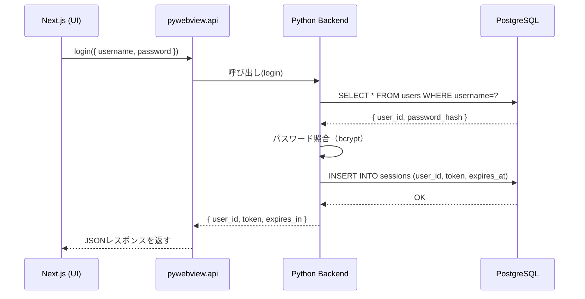

---

## 🧾 register_user()

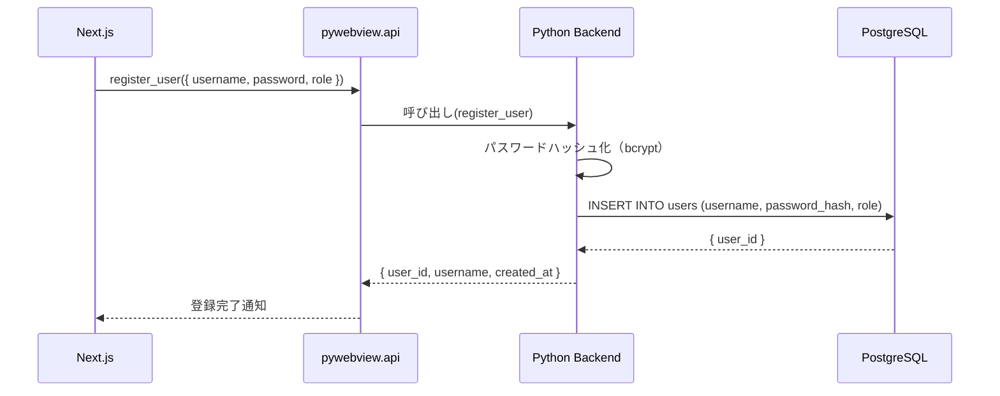

---

## 📄 upload_documents()

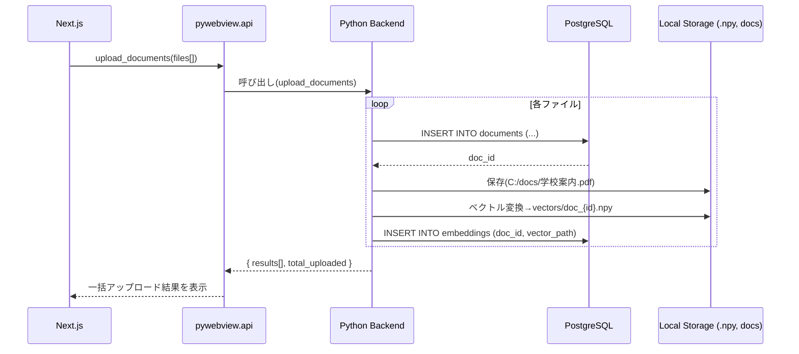

---

## 🔍 search_vector()

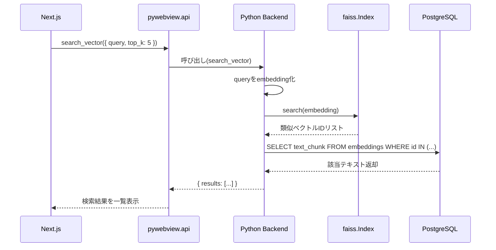

---

## 🧠 generate_embedding()

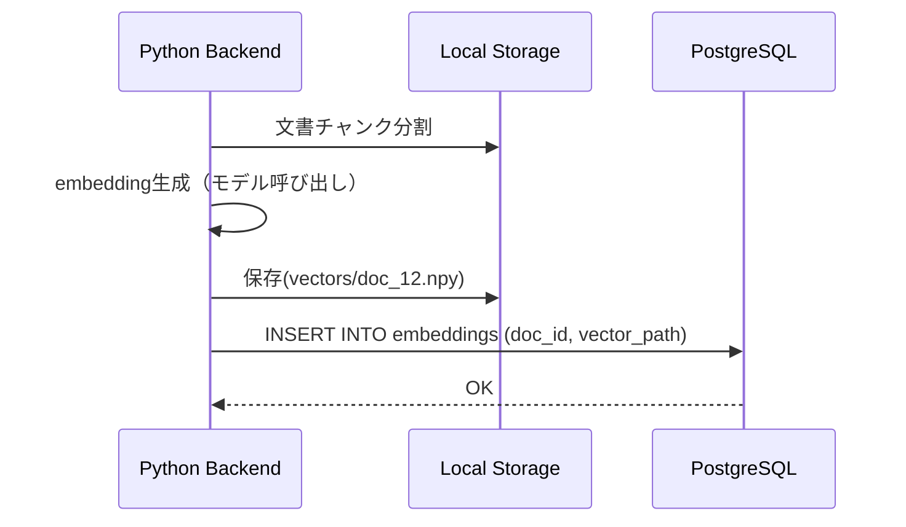

---

## ⚙️ update_setting()

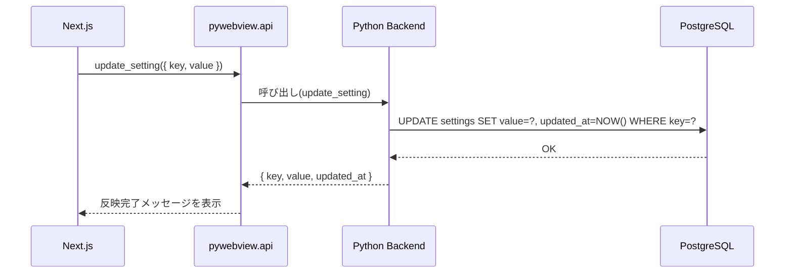

---

## 🏷️ add_tag()

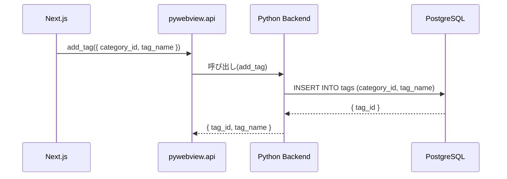

---

## 🤖 upload_model()

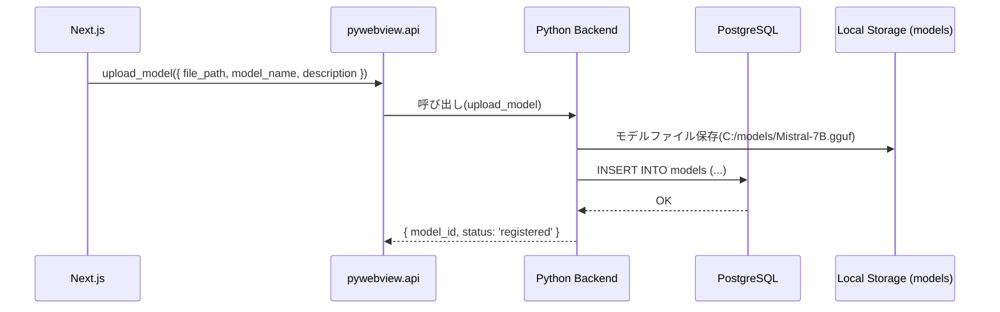

---

## ⚡ activate_model()

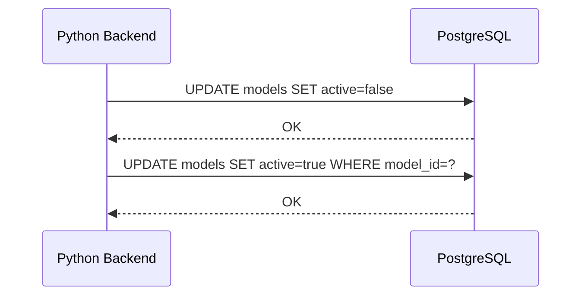

---

## 🪵 get_logs()

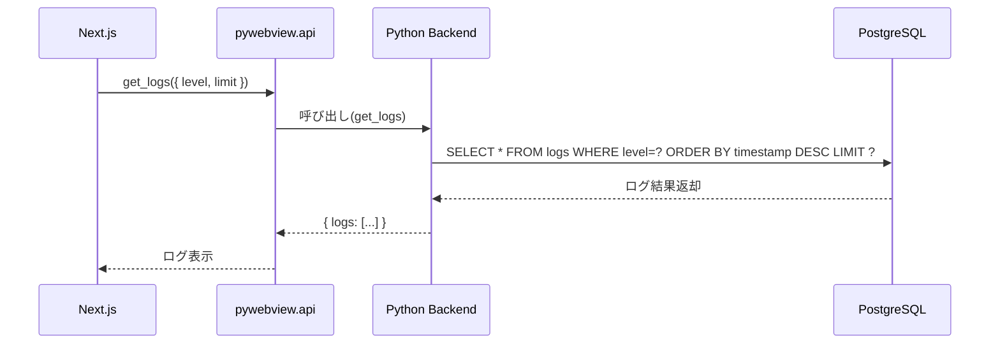

---

## ✅ 全体フロー要約

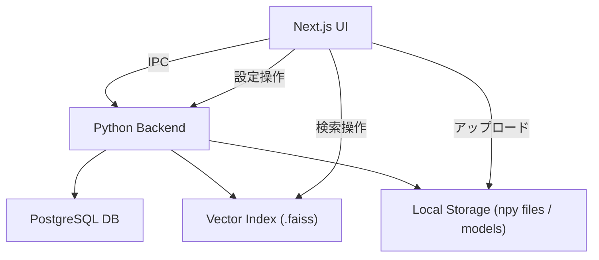

---

### 💡ポイント

* すべての通信は **IPCベース（ポートレス）**。
* DB通信は UNIXソケットで直接接続。
* FAISSは Python内部メモリ上で処理。
* `.npy` や `.faiss`、モデルは Local Storage 上で管理。
* UIは Next.js 静的出力（`next export`）を使用。
